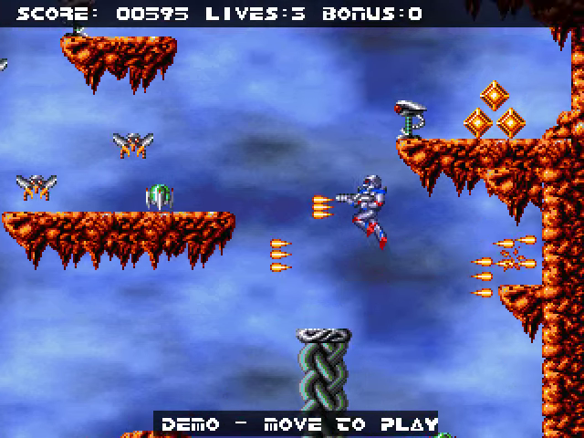
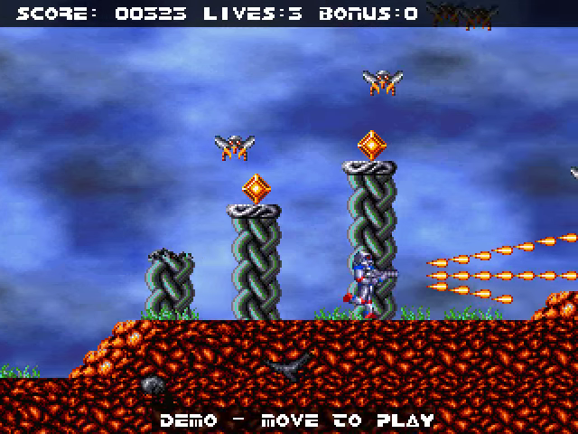
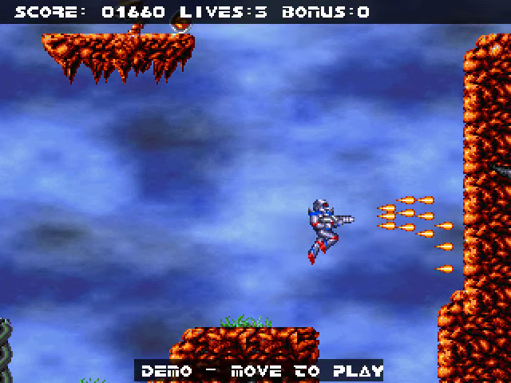
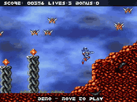

# Turrican32 Go

A native Go/Ebitengine conversion of **T32k**, the Turrican-style game created
for the 32K game competition at Mekka & Symposium 2000.

The game runs at 60 Hz in its original 320 × 240 viewport. The level contains
783 objects across 21 screens, with platforms, moving enemies, turrets,
collectible gems, weapon upgrades, health bonuses and R restart points.
The original sprites, bitmap font and level data are decoded from the game
binary. The procedural cloud and rock textures are generated in Go from the
embedded texture programs.

<!-- Project showcase -->
## Screenshots

[](docs/media/screenshot-1.png)

Jumping between rock platforms with gems and spread shots.

[](docs/media/screenshot-2.png)

Firing past twisted rock columns and flying enemies.

[](docs/media/screenshot-3.png)

Jumping and firing through a narrow vertical rock passage.

## Video

[](https://github.com/olivierh59500/go-turrican32/raw/refs/heads/main/docs/media/preview.mp4)

**[Watch or download the 22-second MP4 preview with sound](https://github.com/olivierh59500/go-turrican32/raw/refs/heads/main/docs/media/preview.mp4)**

This short showcase combines selected passages from the Go production.

The animated image is silent; the MP4 includes the soundtrack.

<!-- End project showcase -->

## Run on desktop

Go 1.26 or newer is required.

```sh
go run .
```

Use `go run . -play` to enter the level directly or `go run . -mute` to disable
audio. All runtime assets are embedded; the original executable is not needed
to play.

`go run . -demo` starts attract mode after the title. F1 toggles the mode; it
also starts automatically after 15 seconds of inactivity on the title.
The recorded circuit climbs platforms, changes direction, collects the weapon
upgrade and returns through a health bonus. It feeds ordinary gamepad inputs
to the same engine as interactive play, with enemies, damage and collisions
enabled. It is a selected circuit, rather than a complete walkthrough of the
level. The title returns between circuits. Move or fire to take control at the
current position. Video export uses this same mode.

| Action | Keyboard |
| --- | --- |
| Move | Left/Right arrows or A/D |
| Jump | Up arrow, W or Space |
| Fire / start | Ctrl |
| Start | Enter |
| Return to title / restart | R |
| Pause | P |
| Mute | M |
| Demo / take control | F1 |
| Return to title / quit from title | Escape |

Release the jump button early for a shorter jump. Weapon pickups increase the
number of projectiles. Collecting an R marker sets the next respawn position.

T32k fires toward the player's facing direction. The basic shot is horizontal;
weapon upgrades add upward and downward projectiles with the original vertical
velocities of ±0.4 and ±0.8 pixels per tick. The steerable lightning beam from
the full Turrican game is not present in this 32K version. Holding Fire does
not enable a separate weapon or aiming mode; release and press it for the next
shot.

## Android

The ARM64 Android application uses a virtual joystick and a separate Fire
button. Push the joystick upward to jump. Fire also starts the game from the
title. Demo, Reset and Pause are available in the side margins. Move the
joystick or press Fire to take over from the demo. The screen stays
awake while the game is visible.

```sh
./scripts/run-android.sh --build-only
./scripts/run-android.sh
```

Building requires Android SDK 36, an Android NDK supported by Ebitengine,
Java 17 and the Go toolchain. Set `ANDROID_HOME` and `JAVA_HOME` if their
installations are not detected. The second command installs and launches the
application on an authorized device connected through ADB. Set
`ANDROID_SERIAL` when more than one device is connected.

The package name is `com.olivierh.turrican32`. The generated debug APK is
`android/app/build/outputs/apk/debug/app-debug.apk`.

## Android release

`./scripts/build-release-android.sh` rebuilds the pinned Go library and produces
a signed ARM64 release in `.local/release/`, without installing an application.
It uses `~/.android-keys/malakh-release.p12` and alias `malakh-release` by default;
`--keystore` and `--alias` select another signing identity. The signing tool asks
for the password in an interactive terminal. `--password-file` can instead name
a private local file containing only that password. Keys/passwords are never
written to project sources or command-line arguments.

`--unsigned-only` builds and validates an aligned release for inspection without
opening the keystore. Unsigned outputs must not be distributed. The signed APK
is verified before replacing the preceding output; its SHA-256 file accompanies
the release. Keep the same application ID and signing key for future updates,
and increment the native Android version code. The current package is ARM64 only.


## Graphics and audio

DCK v1.0.14 provides the image-slot renderer, scrolling background, music
playback and capture/export facilities. Gameplay, collisions and the native
asset decoder are implemented in Go in this project. The simulation uses the
original movement constants, jump release, projectile directions and camera
smoothing, independently of the display refresh rate.

The animated texture layer retains its original 128 wave frames and its
decoration flags. It neither blocks movement nor damages the player. Enemy
shots turn into brief impact sprites when they hit terrain. Spent projectiles
are removed from the active object list to keep repeated demo playback bounded.

The soundtrack uses **Turrican World 1-1** on the title and **Turrican II:
The Desert Rocks** during play. These are YM replacements for the original
C64 SID soundtrack. Audio is opened through DCK.

## Captures

```sh
go run . -play -capture captures/level -frame 120
go run ./cmd/video -duration 3m -poster-at 25s
```

The video command records a deterministic gameplay presentation with its
soundtrack to `recordings/turrican32.mp4` and writes a PNG poster. It requires
FFmpeg. A WebM copy suitable for the portfolio can be produced with:

```sh
ffmpeg -i recordings/turrican32.mp4 \
  -c:v libvpx-vp9 -crf 36 -b:v 0 -cpu-used 2 -threads 4 \
  -c:a libopus -b:a 96k recordings/turrican32.webm
```

## Source layout and checks

- `internal/engine`: platform physics, entities, pickups and restart state.
- `internal/game`: DCK composition, title, viewport and input handling.
- `internal/controls`: virtual joystick with contact ownership and a dead zone.
- `internal/attract`: recorded gameplay input and complete replay validation.
- `internal/extract`: sprite, font and procedural texture decoding.
- `assets`: embedded graphics, level and YM music.
- `mobile` and `android`: Android binding and application shell.

```sh
go test ./...
go vet ./...
```

Tests cover the native spawn and floor height, jump release, weapon/gem
separation, projectile banks and respawn/reset behaviour. A fixture containing
73 samples executed by the original x86 floor routine checks its one-pixel
platform separation. Another fixture checks all 18 projectiles produced by
the original firing routine for both facing directions and three weapon
strengths, including the diagonal velocities and muzzle positions.
These are focused checks; they do not establish
frame-for-frame equivalence for every gameplay sequence. The title movement
and explosion visuals are recreated, rather than exact translations of their
original routines.

## Credits

The original production credits Myth for the game engine, Arthus for graphics,
Arthus and Kojote for design, TmbINC for the title, Ryg for the texture generator
and KB for C64 music and SID emulation. Turrican was created by Manfred Trenz;
the replacement YM tracks are by Jochen Hippel. This conversion is by
Olivier Houte / Malakh Software.
